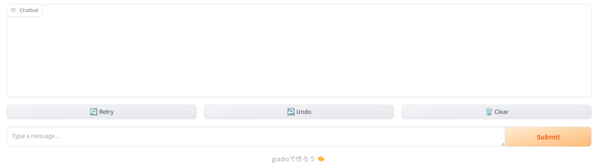

# chrome-llm-sample

## 概要

Chrome ブラウザで動作する文章生成 AI のサンプルコードです。

## Chrome の事前設定

-   バージョン 128 以降の Chrome が必要です。
-   Chrome を起動します。
-   Chrome のアドレスバーに `chrome://flags` と入力して設定画面を開き、次の項目を設定します。

```
1. 「Enables optimization guide on device」の値を 「Enabled BypassPerfRequirement」 に設定。

2. 「Prompt API for Gemini Nano」の値を「Enable」に設定。
```

-   Chrome を再起動します。

-   Chrome のアドレスバーに chrome://components と入力して設定画面を開き、次の項目をクリックして待つ。

```
1. 「Optimization Guide On Device Model」※
```

-   Chrome を再起動します。

※もし 「Optimization Guide On Device Model」 が表示されない場合は、Chrome の開発者モードでコンソールを開き、次のコードを実行してください。

```
    await window.ai.assistant.create();
```

エラーが出ますが問題ありません。

## 使い方

llm.html を Chrome で読み込んでください。次のような画面が表示されたら成功です。お楽しみください。


## お試し

llm.html をダウンロードする前に
[こちら](https://sotokisehiro.github.io/chrome-llm-sample/llm.html)
で動作確認することもできます。

※先に Chrome の事前設定は済ませておいてください。
